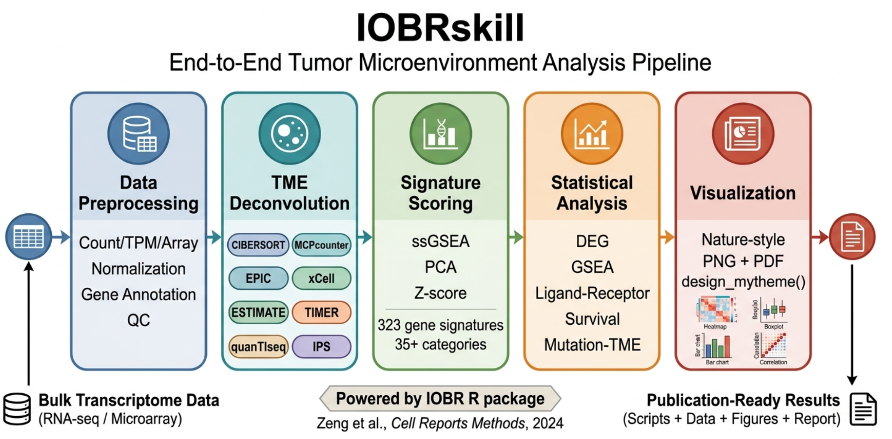

# IOBRskill

A Claude Code skill for end-to-end tumor microenvironment (TME) analysis of bulk transcriptome data using the [IOBR](https://github.com/IOBR/IOBR) R package.

IOBRskill automates the complete TME analysis pipeline — from data preprocessing and annotation through immune cell deconvolution, signature scoring, statistical analysis, and publication-quality visualization — all through natural language interaction with Claude Code.



## What It Does

IOBRskill guides Claude Code through a standardized 5-phase TME analysis workflow:

| Phase | Script | Description |
|-------|--------|-------------|
| 1 | `01-data_preprocessing.R` | Data loading, normalization, probe annotation, QC, batch correction |
| 2 | `02-tme_deconvolution.R` | Immune cell deconvolution (CIBERSORT, MCPcounter, EPIC, xCell, ESTIMATE, TIMER, quanTIseq, IPS) |
| 3 | `03-signature_analysis.R` | Gene signature scoring (ssGSEA/PCA/Z-score), pathway enrichment, TME subtype clustering |
| 4 | `04-statistical_analysis.R` | Differential expression, GSEA, ligand-receptor analysis, survival analysis, mutation-TME interaction |
| 5 | `05-visualization.R` | Nature-style publication figures (dual PNG + PDF format) |

## Requirements

- [Claude Code](https://docs.anthropic.com/en/docs/claude-code) CLI (latest version recommended)
- R ≥ 4.2.0
- [IOBR](https://github.com/IOBR/IOBR) R package ≥ 2.2.0

## Installation

### Step 1 — Install the Skill

Choose **one** of the following methods:

<details>
<summary><b>Method A: Clone to global skills directory (Recommended)</b></summary>

This makes IOBRskill available in **all** your Claude Code sessions:

```bash
git clone https://github.com/IOBR/IOBRskill.git ~/.claude/skills/IOBRskill
```

That's it. Claude Code automatically discovers skills under `~/.claude/skills/`.
</details>

<details>
<summary><b>Method B: Install as a project-level skill</b></summary>

Install into a specific project so the skill only activates in that workspace:

```bash
cd /path/to/your/project
git clone https://github.com/IOBR/IOBRskill.git
```

Or add it as a git submodule:

```bash
cd /path/to/your/project
git submodule add https://github.com/IOBR/IOBRskill.git IOBRskill
```
</details>

<details>
<summary><b>Method C: Manual copy</b></summary>

Download the repository and copy the `IOBRskill/` folder to your preferred location:

```bash
# Download
wget https://github.com/IOBR/IOBRskill/archive/refs/heads/main.zip
unzip main.zip

# Copy to global skills
cp -r IOBRskill-main/ ~/.claude/skills/IOBRskill

# Or copy to a specific project
cp -r IOBRskill-main/ /path/to/your/project/IOBRskill
```
</details>

### Step 2 — Install IOBR R Package

IOBRskill depends on the IOBR R package. Install it in your R environment:

```r
# Install BiocManager if needed
if (!requireNamespace("BiocManager", quietly = TRUE))
    install.packages("BiocManager")

# Install IOBR from GitHub (latest version)
BiocManager::install("IOBR/IOBR")

# Or install from CRAN (stable release)
install.packages("IOBR")

# Verify
packageVersion("IOBR")
# Should print: [1] '2.2.0' or higher
```

If you plan to use CIBERSORT deconvolution, also install:

```r
BiocManager::install("preprocessCore")
```

### Step 3 — Verify

Open Claude Code and test the skill:

```
/IOBRskill
```

You should see the IOBR analysis pipeline launched. If you get an IOBR not found error, run:

```bash
Rscript -e 'library(IOBR); cat("IOBR", as.character(packageVersion("IOBR")), "OK\n")'
```

## Trigger Conditions

IOBRskill activates when you:

- Type `/IOBRskill` directly
- Mention any of these keywords in your prompt:
  - **English**: tumor microenvironment analysis, TME deconvolution, immune infiltration, ligand-receptor analysis, CIBERSORT, MCPcounter, ESTIMATE, immune cell deconvolution
  - **Chinese**: 肿瘤微环境分析, 肿瘤微环境解析, 免疫浸润分析, 受体配体分析, 通路分析

## How to Use

Simply describe what you want to analyze. IOBRskill will interactively guide you through the pipeline:

### Example prompts

```
# Start a full TME analysis
/IOBRskill

# With your own data
"I have a raw count matrix at ~/data/expr.csv from 50 human tumor samples.
I want to do a comprehensive TME analysis."

# Specific method
"Run CIBERSORT and MCPcounter deconvolution on my expression matrix"

# Focus on specific analysis
"I want to analyze ligand-receptor interactions in my TME data"
```

### Interactive decision points

IOBRskill will ask you to choose at these key steps:

1. **Data type** — raw counts, TPM, or microarray; human or mouse
2. **Deconvolution method** — which algorithm(s) to use for TME cell quantification
3. **Signature scoring** — ssGSEA, PCA, or Z-score method
4. **Visualization palette** — color scheme for publication figures

## Output Structure

IOBRskill creates a standardized directory structure. Here is an example from GSE57303 (70 gastric cancer samples, Affymetrix array):

```
GSE57303/
├── 01-script/
│   ├── 01-data_preprocessing.R       # Data QC, normalization, gene annotation
│   ├── 02-tme_deconvolution.R        # CIBERSORT + MCPcounter + ESTIMATE
│   ├── 03-signature_analysis.R       # ssGSEA scoring (TME + IO biomarkers)
│   ├── 04-statistical_analysis.R     # TME subtyping, correlation analysis
│   └── 05-visualization.R            # All publication figures
├── 02-input/
│   ├── annotated_eset.csv            # 21,355 genes × 70 samples (annotated)
│   └── pdata.csv                     # Sample phenotype data
├── 03-tme/
│   ├── tme_cibersort.csv             # 22 immune cell fractions per sample
│   ├── tme_mcpcounter.csv            # 8 cell population scores per sample
│   ├── tme_estimate.csv              # Stromal/Immune/Tumor purity scores
│   ├── sig_score_tme.csv             # 165 TME signature scores (ssGSEA)
│   ├── sig_score_io_biomarkers.csv   # 9 IO biomarker scores
│   ├── tme_subtype.csv               # 3 TME subtypes (K-means clustering)
│   └── correlation_results.csv       # Cell-signature Spearman correlations
├── 04-figs/
│   ├── 01-barplot_cibersort.png/pdf  # CIBERSORT cell composition
│   ├── 02-heatmap_tme.png/pdf        # TME landscape with subtype annotation
│   ├── 03-boxplot_immune_cells.png/pdf # Key immune cells by TME subtype
│   ├── 04-correlation_heatmap.png/pdf  # Cell-signature correlation matrix
│   └── 05-boxplot_mcpcounter.png/pdf   # MCPcounter cell abundance
├── 05-note/
│   └── IOBR-analysis-README.md       # Tree diagram + results interpretation
└── 06-log/
    ├── 01-data_preprocessing.log     # Execution logs per script
    ├── 02-tme_deconvolution.log
    └── ...
```

## Supported Methods

### TME Deconvolution

| Method | Cell Types | Description |
|--------|-----------|-------------|
| CIBERSORT | 22 | Gold standard immune profiling (LM22) |
| MCPcounter | 8 | Stromal + immune quantification |
| EPIC | 8 | Includes cancer cell fraction |
| xCell | 64 | Broadest cell type coverage |
| ESTIMATE | 4 scores | Stromal/Immune/Tumor purity |
| TIMER | 6 | Cancer type-specific |
| quanTIseq | 10 | M1/M2 macrophage resolution |
| IPS | 4 axes | Immunotherapy response prediction |

### Signature Scoring

| Method | Description |
|--------|-------------|
| ssGSEA | Single-sample GSEA (recommended) |
| PCA | Principal component analysis |
| Z-score | Z-score normalization |
| Integration | Combined method |

### Built-in Gene Signatures

IOBR ships with **323 curated gene signatures** organized into 35+ categories:
- TME signatures (186): immune checkpoint, T cell exhaustion, EMT, TME scores
- Hallmark pathways (50)
- Metabolism pathways (113)
- Cell-type-specific signatures from CIBERSORT, MCPcounter, EPIC, xCell, quanTIseq
- Published signatures: Rooney et al, Bindea et al, Li et al, Peng et al, and more

## Dependencies

| Package | Required | Install |
|---------|----------|---------|
| [IOBR](https://github.com/IOBR/IOBR) ≥ 2.2.0 | Yes | `BiocManager::install("IOBR/IOBR")` |
| R ≥ 4.2.0 | Yes | — |
| preprocessCore | For CIBERSORT | `BiocManager::install("preprocessCore")` |
| ggplot2 | For visualization | `install.packages("ggplot2")` |
| pheatmap | For heatmaps | `install.packages("pheatmap")` |

## Skill Structure

```
IOBRskill/
├── SKILL.md                           # Main skill instructions
├── README.md                          # This file
├── evals/
│   └── evals.json                     # Test cases
├── references/
│   ├── functions.md                   # IOBR function parameter reference
│   ├── palettes.md                    # Color palette selection guide
│   └── iobr_built_in_data.md          # Built-in data & signature catalog
└── test/
    ├── GSE57303_series_matrix.txt.gz  # Test data (gastric cancer array)
    └── TCGA-STAD.htseq_counts.tsv.gz  # Test data (stomach adenocarcinoma RNA-seq)
```

## Links

- **IOBR Tutorial Book**: [https://iobr.github.io/book/](https://iobr.github.io/book/)
- **IOBR GitHub**: [https://github.com/IOBR/IOBR](https://github.com/IOBR/IOBR)
- **IOBR on CRAN**: [https://cran.r-project.org/package=IOBR](https://cran.r-project.org/package=IOBR)
- **IOBR Paper (Cell Reports Methods)**: [https://doi.org/10.1016/j.crmeth.2024.100910](https://doi.org/10.1016/j.crmeth.2024.100910)
- **IOBRskill GitHub**: [https://github.com/IOBR/IOBRskill](https://github.com/IOBR/IOBRskill)

## Citation

If you use IOBRskill in your research, please cite IOBR:

> Zeng DQ, Fang YR, … , Yu GC, Liao WJ. Enhancing Immuno-Oncology Investigations Through Multidimensional Decoding of Tumour Microenvironment with IOBR 2.0. *Cell Reports Methods*, 2024. [https://doi.org/10.1016/j.crmeth.2024.100910](https://doi.org/10.1016/j.crmeth.2024.100910)

## Contact

- **Dongqiang Zeng** — [interlaken@smu.edu.cn](mailto:interlaken@smu.edu.cn)
- **Issues**: [https://github.com/IOBR/IOBRskill/issues](https://github.com/IOBR/IOBRskill/issues)


